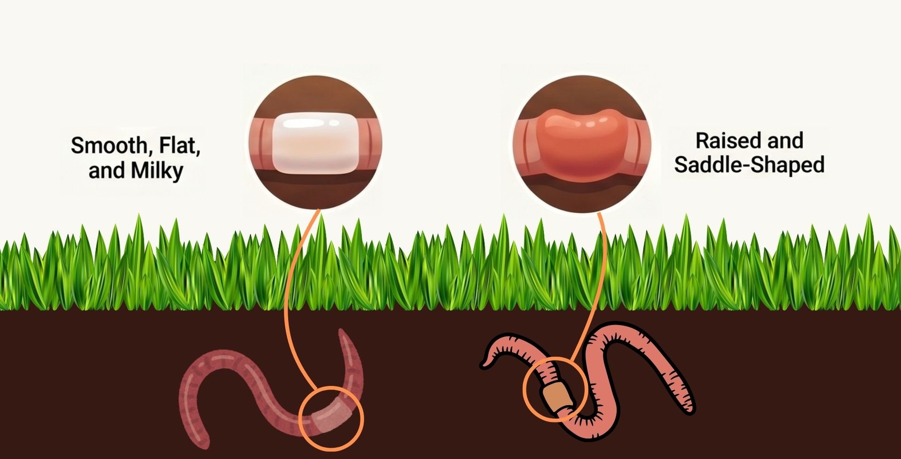

<figure>
  
</figure>

::: {.callout-note icon=false title=""}

As part of this project, we’ve developed a dedicated earthworm identification resource to support your field observations.

You can access:

- An interactive identification key  
- A downloadable, printable guide for field use  

**Visit the identification page:**  
https://maryam-nouriaiin.com/earthworm_id/

If you have questions or would like help identifying a sample, feel free to reach out.

:::
